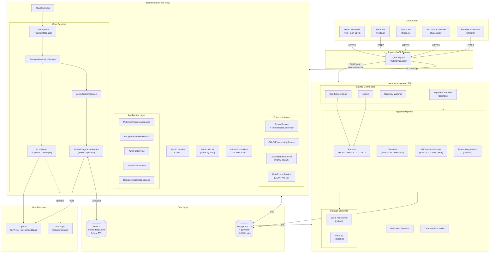

# Docs-inator — AI Documentation Intelligence Platform

> Every developer, support engineer, and technical writer using versioned product documentation should reach for Docs-inator the same way they reach for Google — except the answers are always grounded in *your* documentation, *your* version, and *your* team's institutional knowledge.

---

## Table of Contents

1. [Architecture](#architecture)
2. [Feature Matrix](#feature-matrix)
3. [Prerequisites](#prerequisites)
4. [Quick Start (Local)](#quick-start-local)
5. [Services](#services)
6. [Configuration Reference](#configuration-reference)
7. [Authentication](#authentication)
8. [Multi-Tenancy](#multi-tenancy)
9. [LLM Routing](#llm-routing)
10. [Document Ingestion](#document-ingestion)
11. [Integrations](#integrations)
12. [API Reference](#api-reference)
13. [Database Migrations](#database-migrations)
14. [Deployment](#deployment)
15. [Monitoring](#monitoring)
16. [Project Structure](#project-structure)

---

## Architecture

### System Diagram



### Chat Query Flow

```text
User Message
    │
    ▼
TenantResolutionFilter  →  resolves X-Tenant-Id / JWT claim / default tenant
    │
    ▼
RateLimitFilter         →  30 req/min per user (Bucket4j)
    │
    ▼
JwtAuthFilter / ApiKeyAuthFilter
    │
    ▼
ChatController.sendMessage()
    ├── ContextManager        sliding window (last 10 msgs + LLM summary)
    ├── VectorSearchService   cosine similarity, product+version filtered, top-7
    │       └── EmbeddingCacheService  →  Redis (SHA-256 key) or OpenAI
    ├── MultiHopReasoningService       (for complex multi-step queries)
    ├── AnswerGenerationService
    │       └── LLMRouter  →  tenant config  →  OpenAI / Anthropic + fallback
    ├── QueryLog saved (async)
    ├── PeopleAlsoAskedService (async)
    └── Response + citations + follow-up questions
```

---

## Feature Matrix

| Feature | Phase | Status |
| --- | --- | --- |
| RAG pipeline (PDF / CHM / HTML / TXT) | 0 | ✅ |
| Flyway versioned schema migrations | 0 | ✅ |
| HNSW pgvector index | 0 | ✅ |
| Circuit breakers + retry (Resilience4j) | 0 | ✅ |
| Rate limiting (Bucket4j) | 0 | ✅ |
| JWT authentication + ADMIN/USER roles | 0 | ✅ |
| Answer feedback (thumbs up/down) | 1 | ✅ |
| Source citations with chunk references | 1 | ✅ |
| Answer confidence scoring | 1 | ✅ |
| Chunk annotations | 1 | ✅ |
| Chat sessions with persistent history | 2 | ✅ |
| Auto-summarization at 15 messages | 2 | ✅ |
| Bookmarks | 2 | ✅ |
| User preferences | 2 | ✅ |
| Collections (bookmark groups) | 3 | ✅ |
| Shared chat links | 3 | ✅ |
| Answer upvoting | 3 | ✅ |
| Query analytics dashboard | 4 | ✅ |
| Documentation gap reports | 4 | ✅ |
| Escalation workflow | 4 | ✅ |
| Cost tracking (token usage) | 4 | ✅ |
| Full audit log | 4 | ✅ |
| Product / version access control | 4 | ✅ |
| Public REST API v1 (API key auth) | 5 | ✅ |
| Webhook ingestion (CI/CD) | 5 | ✅ |
| Confluence Cloud connector | 5 | ✅ |
| Notion connector | 5 | ✅ |
| Email digest | 5 | ✅ |
| Slack bot | 5 | ✅ |
| Microsoft Teams bot | 5 | ✅ |
| Browser extension (Chrome) | 5 | ✅ |
| VS Code extension | 5 | ✅ |
| Semantic chunking | 6 | ✅ |
| Multi-hop reasoning | 6 | ✅ |
| People Also Asked | 6 | ✅ |
| Version diff ("what changed?") | 6 | ✅ |
| Answer evolution tracking | 6 | ✅ |
| Auto-generated FAQ clusters | 6 | ✅ |
| Topic subscriptions | 6 | ✅ |
| Multi-tenancy (row-level isolation) | 7 | ✅ |
| OIDC / SSO JIT provisioning | 7 | ✅ |
| GDPR data export (Art. 20) + erasure (Art. 17) | 7 | ✅ |
| Data retention policies (per tenant) | 7 | ✅ |
| Multi-LLM routing (OpenAI + Anthropic) | 7 | ✅ |
| Redis embedding cache | 7 | ✅ |
| AWS S3 document storage | 7 | ✅ |
| PII detection and flagging | 7 | ✅ |
| White-label branding (per tenant) | 7 | ✅ |
| Kubernetes manifests + HPAs | 7 | ✅ |
| Helm chart | 7 | ✅ |

---

## Prerequisites

| Tool | Version | Notes |
| --- | --- | --- |
| Java | 21 | Spring Boot 4.0.2 requires Java 21 |
| Maven | 3.9+ | Wrapper included (`./mvnw`) |
| Node.js | 20+ | Frontend and bot integrations |
| PostgreSQL | 16 | Must have `pgvector` extension |
| Docker | 24+ | For containerised local development, and for MinIO (see below) |
| OpenAI API key | — | Required (embeddings + chat) |
| S3-compatible object storage | — | **Required** — document-ingestor has no local-filesystem fallback; see Quick Start step 2 for a local MinIO container, or point `S3_*` at real AWS S3 |

**Optional (enable extra features):**

| Tool | Enables |
| --- | --- |
| Anthropic API key | Claude as alternate LLM |
| Redis | Embedding cache (degrades gracefully without it) |
| SMTP credentials | Email digest feature, and delivering invitation emails (tenant/user invites are otherwise created but undeliverable — see Quick Start step 6) |

---

## Quick Start (Local)

### 1. Start PostgreSQL with pgvector

```bash
docker run -d \
  --name docai-postgres \
  -e POSTGRES_DB=docai \
  -e POSTGRES_USER=postgres \
  -e POSTGRES_PASSWORD=postgres \
  -p 5432:5432 \
  pgvector/pgvector:pg16
```

### 2. Start MinIO (S3-compatible storage)

document-ingestor has no local-filesystem fallback — it always stores documents in S3-compatible
object storage. MinIO is the easiest way to get that locally:

```bash
docker run -d \
  --name docai-minio \
  -e MINIO_ROOT_USER=minioadmin \
  -e MINIO_ROOT_PASSWORD=minioadmin123 \
  -p 9000:9000 -p 9001:9001 \
  minio/minio server /data --console-address ":9001"

# Create the bucket document-ingestor expects (docai-documents by default)
docker run --rm --network host --entrypoint sh minio/mc -c "
  mc alias set local http://localhost:9000 minioadmin minioadmin123 &&
  mc mb -p local/docai-documents
"
```

### 3. Start document-ingestor

```bash
cd document-ingestor
export OPENAI_API_KEY=sk-...
# Points the ingestor's S3 client at the MinIO container from step 2 — its own default
# (http://minio:9000) is a docker-compose service hostname, not reachable from a bare
# `mvnw spring-boot:run` process. Access/secret key and bucket name already match MinIO's
# defaults above, so only the endpoint needs overriding here.
export S3_ENDPOINT=http://localhost:9000
./mvnw spring-boot:run
# Listening on http://localhost:8081
```

### 4. Start documentation-bot

```bash
cd documentation-bot
export OPENAI_API_KEY=sk-...
export JWT_SECRET=$(openssl rand -base64 64)
./mvnw spring-boot:run
# Listening on http://localhost:8082
```

On first run (empty `users` table), `AdminSeeder` creates a single fixed **SUPER_ADMIN** account —
`admin` / `Opentext123$` by default (override with `SEED_ADMIN_USERNAME`/`SEED_ADMIN_EMAIL`/
`SEED_ADMIN_PASSWORD`). There is no public self-registration endpoint — every other account is
provisioned by invitation (see Authentication below).

### 5. Start the frontend

```bash
cd frontend
npm install
npm run dev
# Opens http://localhost:5173/docs-inator
```

### 6. Log in, change the seeded password, and create your tenant

The seeded SUPER_ADMIN has no tenant of its own — it exists only to create tenants and invite each
one's first ADMIN. `mustChangePassword` is set on that seeded account, so:

```bash
# 1. Log in as the seeded SUPER_ADMIN
TOKEN=$(curl -s -X POST http://localhost:8082/api/auth/login \
  -H "Content-Type: application/json" \
  -d '{"username":"admin","password":"Opentext123$"}' | jq -r .token)

# 2. Change the password (required before anything else works)
curl -s -X POST http://localhost:8082/api/auth/change-password \
  -H "Authorization: Bearer $TOKEN" -H "Content-Type: application/json" \
  -d '{"currentPassword":"Opentext123$","newPassword":"<a real password, 10+ chars>"}'

# 3. Create a tenant — this emails adminEmail an invite to become that tenant's first ADMIN
curl -s -X POST http://localhost:8082/api/admin/tenants \
  -H "Authorization: Bearer $TOKEN" -H "Content-Type: application/json" \
  -d '{"name":"My Company","slug":"my-company","plan":"standard","maxUsers":10,"maxDocuments":100,"adminEmail":"you@example.com"}'
```

Step 3 requires SMTP to actually be configured (`MAIL_HOST`/`MAIL_USERNAME`/`MAIL_PASSWORD` — see
Configuration Reference) — the invitation is created either way, but the accept link is only ever
delivered by email; there's currently no way to view a pending invitation's link outside the email
it was sent to. Once you receive it, accept it (sets your own username/password for that tenant):

```bash
curl -s -X POST http://localhost:8082/api/auth/accept-invite \
  -H "Content-Type: application/json" \
  -d '{"token":"<token from the emailed link>","username":"you","password":"<a real password, 10+ chars>"}'
```

### 7. Upload a document

```bash
TOKEN=$(curl -s -X POST http://localhost:8082/api/auth/login \
  -H "Content-Type: application/json" \
  -d '{"username":"you","password":"<the password from step 6>"}' | jq -r .token)

curl -X POST http://localhost:8081/api/documents/upload \
  -H "Authorization: Bearer $TOKEN" \
  -F "file=@my-manual.pdf" \
  -F "product=MyProduct" \
  -F "version=2.1.0"
```

---

## Services

### documentation-bot (port 8082)

The main API service. Handles all user interactions, authentication, chat, and AI reasoning.

**Key responsibilities:**
- Multi-turn chat sessions with sliding-window context management
- Product + version scoped vector similarity search
- Multi-LLM routing with automatic fallback
- JWT + API key authentication, rate limiting, OIDC JIT provisioning
- Multi-tenancy via `TenantResolutionFilter` (ThreadLocal context)
- GDPR compliance (data export and erasure)
- Auto-generated FAQ, version diff, multi-hop reasoning, People Also Asked
- Admin analytics, gap reports, escalation workflow, cost tracking
- Email digests, in-app notifications, topic subscriptions

### document-ingestor (port 8081)

The ingestion pipeline service. Processes raw documents into searchable vector embeddings.

**Key responsibilities:**
- Document parsing: PDF, CHM, HTML, plain text/Markdown (`.pdf`, `.chm`, `.html`/`.htm`, `.txt`/`.md`).
  Structure-preserving extraction (headings, tables, code blocks) is fully effective for CHM and
  HTML; for PDF it's partial — PDF is fixed-layout, so PDFBox-based extraction recovers accurate
  paragraph text and boundaries but not reconstructed headings/tables the way native markup does.
- Chunking strategies: fixed-size (512 tokens, 50-token overlap) and embedding-based semantic
- OpenAI embedding generation and storage into pgvector
- PII detection and flagging before storage (SSN, credit cards, AWS keys, email, phone, IP)
- Storage: S3-compatible object storage only (MinIO for local/self-hosted, or real AWS S3 — no local-filesystem backend exists)
- Source connectors: Confluence Cloud, Notion, directory watcher
- Webhook ingestion for CI/CD pipeline integration

---

## Configuration Reference

All configuration is environment-variable-driven. Defaults work out of the box for local development.

### documentation-bot

| Variable | Default | Description |
| --- | --- | --- |
| `OPENAI_API_KEY` | **required** | OpenAI API key |
| `JWT_SECRET` | weak dev value | Base64-encoded secret — **always override in production** |
| `SECRETS_ENCRYPTION_KEY` | *(ephemeral in dev)* | AES-256 key (base64, 32 bytes) for encrypting per-tenant LLM keys and integration tokens at rest — **required in production**, and must be the same value on document-ingestor. Generate with `openssl rand -base64 32` |
| `SPRING_DATABASE_URL` | `jdbc:postgresql://localhost:5432/docai` | PostgreSQL JDBC URL |
| `SPRING_DATABASE_USERNAME` | `postgres` | DB username |
| `SPRING_DATABASE_PASSWORD` | `postgres` | DB password |
| `SEED_ADMIN_USERNAME` | `admin` | First-run SUPER_ADMIN username, seeded only when the `users` table is empty |
| `SEED_ADMIN_EMAIL` | `admin@docs-inator.local` | First-run SUPER_ADMIN email |
| `SEED_ADMIN_PASSWORD` | `Opentext123$` | First-run SUPER_ADMIN password — **override before any real deployment**; must be changed on first login regardless |
| `ANTHROPIC_API_KEY` | *(disabled)* | Enables Anthropic Claude as LLM option |
| `ANTHROPIC_CHAT_MODEL` | `claude-sonnet-4-6` | Anthropic model (when `ANTHROPIC_API_KEY` is set) |
| `REDIS_HOST` | *(disabled)* | Redis hostname — omit to disable embedding cache |
| `REDIS_PORT` | `6379` | Redis port |
| `REDIS_PASSWORD` | *(none)* | Redis auth password |
| `OPENAI_CHAT_MODEL` | `gpt-4o-mini` | Default chat model |
| `OPENAI_EMBEDDING_MODEL` | `text-embedding-3-small` | Embedding model — must match document-ingestor's |
| `CORS_ALLOWED_ORIGINS` | `http://localhost:5173,http://localhost:3000` | Comma-separated allowed CORS origins |
| `RATE_LIMIT_PER_MINUTE` | `30` | Max chat requests per minute per user |
| `AUTH_RATE_LIMIT_PER_MINUTE` | `10` | Max unauthenticated requests per minute per IP to `/api/auth/login` and `/api/auth/refresh` |
| `AUTH_MAX_FAILED_ATTEMPTS` | `10` | Failed login attempts before an account is locked out |
| `AUTH_LOCKOUT_DURATION_MINUTES` | `15` | Lockout duration after `AUTH_MAX_FAILED_ATTEMPTS` is exceeded |
| `JWT_EXPIRATION_MS` | `86400000` | Access token lifetime (default: 24 hours) |
| `JWT_REFRESH_EXPIRATION_MS` | `2592000000` | Refresh token lifetime (default: 30 days) |
| `MAIL_HOST` | `smtp.gmail.com` | SMTP host — required for invitation and digest emails |
| `MAIL_PORT` | `587` | SMTP port |
| `MAIL_USERNAME` | *(disabled)* | SMTP username |
| `MAIL_PASSWORD` | *(disabled)* | SMTP password |
| `MAIL_FROM` | `noreply@docs-inator.example.com` | From-address for digest and invitation emails |
| `MAIL_FROM_NAME` | `Docs-inator` | From-name for digest and invitation emails |
| `APP_URL` | `http://localhost:5173` | Base URL used to build links in emails (e.g. the accept-invite link) |
| `BOT_MIN_SIMILARITY_THRESHOLD` | `0.55` | Minimum vector-search similarity for a chunk to be used as context |
| `BOT_COST_INPUT_PER_1K` | `0.00015` | USD cost per 1K input tokens, for cost-tracking analytics |
| `BOT_COST_OUTPUT_PER_1K` | `0.00060` | USD cost per 1K output tokens, for cost-tracking analytics |
| `INGESTOR_INTERNAL_URL` | `http://document-ingestor:8081` | document-ingestor's internal base URL, used to resolve "open citation" download links |
| `INTERNAL_SERVICE_SECRET` | *(disabled)* | Shared HMAC secret for bot→ingestor internal calls — must match document-ingestor's own `INTERNAL_SERVICE_SECRET` |

### document-ingestor

| Variable | Default | Description |
| --- | --- | --- |
| `OPENAI_API_KEY` | **required** | OpenAI API key (for embeddings) |
| `JWT_SECRET` | weak dev value | Must match documentation-bot's `JWT_SECRET` |
| `SECRETS_ENCRYPTION_KEY` | *(ephemeral in dev)* | AES-256 key (base64, 32 bytes) for encrypting Confluence/Notion integration tokens at rest — **required in production**, must match documentation-bot's `SECRETS_ENCRYPTION_KEY` |
| `SPRING_DATABASE_URL` | `jdbc:postgresql://localhost:5432/docai` | Same database as bot |
| `STORAGE_TYPE` | `s3` | S3-compatible object storage is the only supported backend — there is no local-filesystem option |
| `S3_BUCKET` | `docai-documents` | S3 bucket name |
| `S3_ENDPOINT` | `http://minio:9000` | S3 endpoint — point at MinIO for local/self-hosted, or omit/override for real AWS S3 |
| `S3_REGION` | `us-east-1` | S3 region |
| `S3_ACCESS_KEY` | `minioadmin` | S3 access key |
| `S3_SECRET_KEY` | `minioadmin123` | S3 secret key |
| `S3_PATH_STYLE_ACCESS` | `true` | Path-style addressing (required for MinIO) — set `false` for real AWS S3 |
| `MAX_UPLOAD_SIZE` | `100MB` | Max single-file upload size |
| `MAX_REQUEST_SIZE` | `100MB` | Max multipart request size |
| `STUCK_PROCESSING_TIMEOUT_MINUTES` | `30` | A document stuck in `PROCESSING` longer than this is reaped to `FAILED` |
| `SSRF_HTTP_ALLOWED_HOSTS` | `localhost,127.0.0.1` | Hosts allowed over plain HTTP for server-side fetches (webhook download URLs, Confluence). Dev/test convenience only — never add a real external host |
| `CONFLUENCE_HOST_ALLOWLIST` | `.atlassian.net` | Required hostname suffix for registered Confluence site URLs |
| `WEBHOOK_HMAC_SECRET` | *(disabled)* | Shared secret CI/CD systems use to sign `POST /api/v1/ingest/webhook` bodies. Unset in dev falls back to requiring an ADMIN JWT instead |
| `INTERNAL_SERVICE_SECRET` | *(disabled)* | Shared HMAC secret for bot→ingestor internal calls — must match documentation-bot's own `INTERNAL_SERVICE_SECRET`. Unset disables the internal API entirely |
| `CORS_ALLOWED_ORIGINS` | `http://localhost:5173,http://localhost:3000` | Comma-separated allowed CORS origins |

---

## Authentication

Three methods are supported; they are evaluated in order per request.

### 1. JWT (interactive users)

There is no public self-registration endpoint — accounts are invitation-only (see
[Quick Start](#quick-start-local) for the full seed-admin → invite → accept flow). Once an account
exists:

```bash
# Login → returns {"token":"eyJ...","refreshToken":"..."}
curl -X POST http://localhost:8082/api/auth/login \
  -H "Content-Type: application/json" \
  -d '{"username":"alice","password":"secret"}'

# Subsequent requests
Authorization: Bearer eyJ...
```

### 2. API Keys (integrations and CI/CD)

```bash
# Create a key (requires JWT auth)
curl -X POST http://localhost:8082/api/user/api-keys \
  -H "Authorization: Bearer eyJ..." \
  -H "Content-Type: application/json" \
  -d '{"name":"CI pipeline"}'
# Returns {"key":"dak_..."}

# Use the key
X-API-Key: dak_...
```

### 3. OIDC / SSO (enterprise tenants)

The backend performs JIT provisioning — your frontend authenticates with the IdP (Google, Okta, Azure AD, etc.), then sends the decoded claims to the backend which creates or updates the local user and issues an app JWT.

```bash
# 1. Get tenant OIDC configuration
GET /api/auth/oidc/config?slug=acme

# 2. Exchange IdP claims for an app JWT
POST /api/auth/oidc/callback
Content-Type: application/json
{
  "provider": "google",
  "claims": {
    "sub": "1234567890",
    "email": "alice@acme.com",
    "name": "Alice Smith",
    "picture": "https://..."
  }
}
# Returns {"token":"eyJ..."}
```

OIDC is configured per-tenant via **Admin → Tenants → Edit**.

---

## Multi-Tenancy

All data tables carry a `tenant_id` column. Queries are automatically scoped to the current tenant — no data from one tenant is ever visible to another.

**Tenant resolution order** (per request):

| Priority | Source | Notes |
| --- | --- | --- |
| 1 | Authenticated principal's own `tenantId` (from the JWT or API key already resolved earlier in the filter chain) | Authoritative and never overridden by a header — an authenticated caller cannot pick a different tenant to act as, closing a prior cross-tenant IDOR. `null` for `SUPER_ADMIN`, intentionally platform-wide |
| 2 | `X-Tenant-Id` header (UUID) | Only consulted when there is **no** authenticated principal, e.g. a pre-login public branding/FAQ lookup |
| 3 | `X-Tenant-Slug` header (slug lookup) | Same — unauthenticated requests only |

If none resolve, no tenant is set for the request — there is no default tenant fallback. Endpoints that require a tenant reject the request; the handful of legitimately tenant-optional endpoints handle the unset case explicitly.

The resolved UUID is stored in `TenantContext` (ThreadLocal) for the request lifetime and always cleared in a `finally` block to prevent leaks between requests.

**Creating a tenant** (ADMIN role required):

```bash
POST /api/admin/tenants
Authorization: Bearer <admin-token>
Content-Type: application/json
{
  "name": "Acme Corp",
  "slug": "acme",
  "plan": "ENTERPRISE",
  "maxUsers": 500,
  "maxDocuments": 10000
}
```

---

## LLM Routing

`LLMRouter` selects the provider and model for each request based on the calling tenant's configuration, with automatic fallback to OpenAI if the primary provider fails.

```text
Tenant has LLM config?
  ├─ YES, smartRouting = true
  │     simple query  →  simpleQueryModel  (e.g. gpt-4o-mini)
  │     complex query →  complexQueryModel (e.g. gpt-4o)
  ├─ YES, smartRouting = false
  │     always use  →  chatModel
  └─ NO  →  OpenAI gpt-4o-mini (platform default)

Any provider exception  →  automatic fallback to OpenAI gpt-4o-mini
```

**Configure per tenant** (ADMIN role):

```bash
PUT /api/admin/tenants/{id}/llm-config
Content-Type: application/json
{
  "provider": "anthropic",
  "chatModel": "claude-sonnet-4-6",
  "embeddingProvider": "openai",
  "smartRouting": true,
  "simpleQueryModel": "gpt-4o-mini",
  "complexQueryModel": "gpt-4o"
}
```

Available providers: `openai`, `anthropic`, `azure_openai`

Anthropic is only active when `ANTHROPIC_API_KEY` is set. If a tenant is configured to use Anthropic but the key is missing, routing falls back to OpenAI automatically.

---

## Document Ingestion

### Upload a document

```bash
curl -X POST http://localhost:8081/api/ingest \
  -H "Authorization: Bearer <token>" \
  -F "file=@installation-guide.pdf" \
  -F "product=MyProduct" \
  -F "version=2.1.0"
```

Supported formats: `.pdf`, `.chm`, `.html`, `.htm`, `.txt`, `.md`

The pipeline runs: parse → chunk → PII scan → embed → store.

### Chunking strategies

| Strategy | When to use | Parameters |
| --- | --- | --- |
| Fixed-size | Uniform structured docs (API references) | 512 tokens, 50-token overlap |
| Semantic | Narrative docs (user guides, tutorials) | Embedding-based boundary detection |

Semantic chunking detects natural topic boundaries by comparing embedding similarity between consecutive sentences — a split is inserted where similarity drops below threshold.

### Webhook ingestion (CI/CD)

Trigger re-ingestion automatically when documentation is published:

```bash
# Register a webhook
POST /api/webhooks
{"product": "MyProduct", "version": "2.1.0", "secret": "webhook-secret"}

# Fire on doc publish
POST /api/webhooks/{webhookId}/ingest
X-Webhook-Signature: sha256=<hmac-sha256 of body>
Content-Type: application/json
{"url": "https://docs.example.com/page", "content": "..."}
```

### Connector sync

```bash
# Confluence — sync a space
POST /api/connectors/confluence/sync
{"spaceKey": "ENG", "product": "MyProduct", "version": "latest"}

# Notion — sync a database
POST /api/connectors/notion/sync
{"databaseId": "abc123", "product": "MyProduct", "version": "latest"}
```

Integration tokens are stored per-tenant in the `integration_tokens` table.

---

## Integrations

### Slack Bot

```bash
cd slack-bot && npm install
SLACK_BOT_TOKEN=xoxb-... \
SLACK_APP_TOKEN=xapp-... \
DOCS_AI_URL=http://localhost:8082 \
DOCS_AI_TOKEN=<api-key> \
node src/index.js
```

Usage: `@docs-inator What changed between v2.0 and v2.1?`

### Microsoft Teams Bot

```bash
cd teams-bot && npm install
MicrosoftAppId=<app-id> \
MicrosoftAppPassword=<app-password> \
DOCS_AI_URL=http://localhost:8082 \
DOCS_AI_TOKEN=<api-key> \
node src/index.js
```

### VS Code Extension

1. `cd vscode-extension && npm install`
2. Open in VS Code and press **F5** to launch Extension Development Host
3. Use the command palette: `Docs-inator: Ask`

### Browser Extension (Chrome)

1. Open `chrome://extensions/`
2. Enable **Developer mode**
3. Click **Load unpacked** → select `browser-extension/`
4. Highlight text on any page → click the Docs-inator icon → ask your question

---

## API Reference

Full interactive spec is served at runtime:
- `GET /v3/api-docs` — OpenAPI JSON
- `GET /swagger-ui.html` — Swagger UI

### Chat

| Method | Path | Auth | Description |
| --- | --- | --- | --- |
| `POST` | `/api/chat/sessions` | JWT | Create session |
| `GET` | `/api/chat/sessions` | JWT | List your sessions |
| `POST` | `/api/chat/sessions/{id}/messages` | JWT | Send a message |
| `GET` | `/api/chat/sessions/{id}/messages` | JWT | Get message history |
| `DELETE` | `/api/chat/sessions/{id}` | JWT | Delete session |
| `POST` | `/api/chat/sessions/{id}/pin` | JWT | Pin / unpin |
| `POST` | `/api/chat/sessions/{id}/rename` | JWT | Rename |
| `GET` | `/api/share/{token}` | Public | View shared chat |

### Public API v1

| Method | Path | Auth | Description |
| --- | --- | --- | --- |
| `POST` | `/api/v1/query` | API-Key | Query documentation |
| `GET` | `/api/v1/products` | API-Key | List products |
| `GET` | `/api/v1/products/{id}/versions` | API-Key | List versions |

### Intelligence

| Method | Path | Auth | Description |
| --- | --- | --- | --- |
| `POST` | `/api/intelligence/multi-hop` | JWT | Multi-step reasoning |
| `GET` | `/api/intelligence/people-also-asked/{sessionId}` | JWT | Related questions |
| `GET` | `/api/intelligence/version-diff` | JWT | What changed between versions |
| `GET` | `/api/intelligence/answer-evolution/{topic}` | JWT | How answers evolved |
| `GET` | `/api/faq` | Public | Browse FAQ clusters |

### Bookmarks & Collections

| Method | Path | Description |
| --- | --- | --- |
| `POST` | `/api/user/bookmarks` | Bookmark a message |
| `GET` | `/api/user/bookmarks` | List bookmarks |
| `POST` | `/api/user/collections` | Create collection |
| `POST` | `/api/user/collections/{id}/items` | Add to collection |

### Subscriptions & Notifications

| Method | Path | Description |
| --- | --- | --- |
| `POST` | `/api/user/subscriptions` | Subscribe to a topic |
| `GET` | `/api/user/subscriptions` | List subscriptions |
| `GET` | `/api/user/notifications` | Get notifications |

### Admin (ADMIN role)

| Method | Path | Description |
| --- | --- | --- |
| `GET` | `/api/admin/analytics/overview` | Query volume, top queries |
| `GET` | `/api/admin/gap-reports` | Documentation gaps |
| `GET` | `/api/admin/escalations` | Escalated queries |
| `GET` | `/api/admin/audit-logs` | Full audit trail |
| `GET/POST` | `/api/admin/tenants` | List / create tenants |
| `GET/PUT` | `/api/admin/tenants/{id}/branding` | White-label branding |
| `GET/PUT` | `/api/admin/tenants/{id}/llm-config` | LLM routing config |
| `GET/PUT` | `/api/admin/tenants/{id}/retention` | Data retention policy |
| `GET` | `/api/admin/users/{id}/access` | User product access |

### GDPR

| Method | Path | Description |
| --- | --- | --- |
| `GET` | `/api/user/gdpr/export` | Download all your data (JSON file) |
| `DELETE` | `/api/user/gdpr/me` | Request account erasure |
| `GET` | `/api/user/gdpr/admin/deletion-requests` | Admin: pending erasure requests |

---

## Database Migrations

Flyway manages all schema changes automatically on startup. Each service has its own migration history table (`flyway_schema_history_bot` and `flyway_schema_history_ingestor`) so both can share the same database without conflicts.

To add a migration: create `V{N}__short_description.sql` in `src/main/resources/db/migration/`. Never edit an already-applied migration.

### documentation-bot (V1 – V12)

| Version | Description |
| --- | --- |
| V1 | Initial schema — users, documents, chunks, chat, feedback |
| V2 | HNSW pgvector index on `document_chunks.embedding` |
| V3 | Answer feedback table |
| V4 | Chat session pinning, bookmarks |
| V5 | User preferences |
| V6 | Collections, shared chat links, answer upvotes |
| V7 | Analytics — query logs, cost tracking |
| V8 | API keys |
| V9 | Email digest tracking |
| V10 | Intelligence — FAQ clusters, version diff, query session graph |
| V11 | Multi-tenancy — `tenants` table, `tenant_id` on all user-data tables |
| V12 | Compliance — data retention, GDPR deletion requests, tenant branding, tenant LLM configs |

### document-ingestor (V1 – V6)

| Version | Description |
| --- | --- |
| V1 | Initial schema — documents, document_chunks |
| V2 | HNSW pgvector index |
| V3 | Webhook events |
| V4 | Connector sync pages, integration tokens |
| V5 | Semantic chunking metadata |
| V6 | Tenant isolation, S3 storage fields, PII flags |

---

## Deployment

### Docker

```bash
# Build service images
docker build -t documentation-bot:latest ./documentation-bot
docker build -t document-ingestor:latest ./document-ingestor

# Build frontend static assets
cd frontend && npm run build   # outputs to frontend/dist/
```

### Kubernetes (raw manifests)

```bash
kubectl apply -f k8s/namespace.yaml
kubectl apply -f k8s/configmap.yaml
kubectl apply -f k8s/secrets.yaml          # edit values first
kubectl apply -f k8s/postgres-statefulset.yaml
kubectl apply -f k8s/postgres-backup-cronjob.yaml
kubectl apply -f k8s/redis-deployment.yaml
kubectl apply -f k8s/documentation-bot-deployment.yaml
kubectl apply -f k8s/document-ingestor-deployment.yaml
kubectl apply -f k8s/ingress.yaml
```

### Database Backups & Restore

A `CronJob` (`k8s/postgres-backup-cronjob.yaml`, or `postgres.backup.*` in the Helm chart) runs
nightly at 03:00 UTC: `pg_dump -Fc` the `docai` database and upload it to the same S3/MinIO bucket
document-ingestor stores documents in, under `backups/docai-<timestamp>.dump`. Backups older than
14 days (`postgres.backup.retentionDays` in Helm) are pruned automatically. This only applies when
Postgres is deployed by this chart (`postgres.enabled: true`) — if you point `SPRING_DATABASE_URL`
at an external managed database instead, backups are that provider's responsibility, not this
job's.

To restore into a scratch database (verify a backup is actually restorable, or recover from data
loss):

```bash
# 1. Fetch the dump you want to restore from S3/MinIO
aws s3 cp s3://<bucket>/backups/docai-<timestamp>.dump ./docai-restore.dump
#   (MinIO: add --endpoint-url http://<minio-host>:9000)

# 2. Restore into a fresh, separate database — never directly over a live one
createdb -h <postgres-host> -U <user> docai_restore_test
pg_restore -h <postgres-host> -U <user> -d docai_restore_test --no-owner --clean docai-restore.dump

# 3. Spot-check row counts / a few known tenants, then either:
#    a) point a scratch instance of the app at docai_restore_test to validate at the app layer, or
#    b) for a real recovery: rename the broken DB aside, rename docai_restore_test to docai,
#       restart both services.
```

### Helm (recommended for production)

```bash
# Install
helm install doc-ai ./helm/doc-ai-system \
  --namespace doc-ai --create-namespace \
  --set global.imageRegistry=your-registry.io \
  --set secrets.openaiApiKey="sk-..." \
  --set secrets.jwtSecret="$(openssl rand -base64 64)" \
  --set secrets.dbPassword="$(openssl rand -base64 32)" \
  --set ingress.host=api.your-domain.com \
  --set config.corsAllowedOrigins="https://app.your-domain.com"

# Upgrade
helm upgrade doc-ai ./helm/doc-ai-system \
  --reuse-values \
  --set bot.image.tag=v1.2.0

# Scale
helm upgrade doc-ai ./helm/doc-ai-system \
  --reuse-values \
  --set bot.replicaCount=5
```

**Key `values.yaml` knobs:**

| Key | Default | Description |
| --- | --- | --- |
| `bot.replicaCount` | `2` | Bot pod count |
| `ingestor.replicaCount` | `2` | Ingestor pod count |
| `bot.hpa.maxReplicas` | `10` | Bot HPA ceiling |
| `ingestor.hpa.maxReplicas` | `6` | Ingestor HPA ceiling |
| `redis.enabled` | `true` | Deploy Redis (set `false` to use external) |
| `postgres.enabled` | `true` | Deploy PostgreSQL (set `false` to use managed DB) |
| `postgres.storageSize` | `50Gi` | PVC size for PostgreSQL |
| `config.storageType` | `s3` | `local` or `s3` |
| `ingress.host` | — | Public hostname (TLS auto-provisioned via cert-manager) |

---

## Monitoring

### Health endpoints

```text
GET /actuator/health           — combined liveness + readiness
GET /actuator/health/liveness  — liveness probe
GET /actuator/health/readiness — readiness probe
GET /actuator/info
```

### Prometheus metrics

```text
GET /actuator/prometheus
```

Key metrics:
- `http_server_requests_seconds` — latency histogram by endpoint
- `jvm_memory_used_bytes` — heap pressure
- `hikaricp_connections_active` — DB connection pool saturation
- `resilience4j_circuitbreaker_state` — LLM circuit breaker (0=CLOSED, 1=OPEN)
- `cache.gets{result="hit"}` / `cache.gets{result="miss"}` — Redis embedding cache

**Recommended Grafana dashboard imports:**

| Dashboard | Grafana ID |
| --- | --- |
| JVM Micrometer | 4701 |
| Spring Boot 3.x Statistics | 11378 |
| Redis Dashboard | 763 |

### Structured logging

All services emit JSON logs in production. Key fields: `timestamp`, `level`, `service`, `tenantId`, `userId`, `traceId`, `message`.

---

## Project Structure

```text
doc-ai-system/
│
├── documentation-bot/             Spring Boot 4 — chat, auth, intelligence
│   └── src/main/
│       ├── java/com/docai/bot/
│       │   ├── adapter/rest/      25+ REST controllers
│       │   ├── application/       50+ services
│       │   ├── config/            Security, JWT, tenant filters, rate limit
│       │   └── domain/            30+ JPA entities, 25+ repositories
│       └── resources/
│           ├── application.yml
│           └── db/migration/      V1–V12 Flyway scripts
│
├── document-ingestor/             Spring Boot 4 — ingestion pipeline
│   └── src/main/
│       ├── java/com/docai/ingestor/
│       │   ├── adapter/rest/      Upload, webhook, connector endpoints
│       │   ├── application/       Parsers, chunkers, embedder, storage, PII
│       │   ├── config/            JWT validation, async
│       │   ├── domain/            Entities, repositories
│       │   └── infrastructure/    Directory watcher
│       └── resources/
│           ├── application.yml
│           └── db/migration/      V1–V6 Flyway scripts
│
├── frontend/                      React 18 + Vite + Tailwind CSS
│   └── src/
│       ├── components/            25+ components (Chat, Admin, Bookmarks…)
│       ├── context/               AuthContext, BrandingContext
│       ├── services/              20+ typed API service modules
│       └── hooks/
│
├── slack-bot/                     Node.js — Slack Bolt integration
├── teams-bot/                     Node.js — Bot Framework integration
├── vscode-extension/              TypeScript — VS Code sidebar extension
├── browser-extension/             Chrome extension (Manifest v3)
│
├── k8s/                           Raw Kubernetes manifests
│   ├── namespace.yaml
│   ├── configmap.yaml
│   ├── secrets.yaml
│   ├── postgres-statefulset.yaml
│   ├── redis-deployment.yaml
│   ├── documentation-bot-deployment.yaml
│   ├── document-ingestor-deployment.yaml
│   └── ingress.yaml
│
└── helm/doc-ai-system/            Helm chart
    ├── Chart.yaml
    ├── values.yaml
    └── templates/                 8 templates (bot, ingestor, postgres, redis, ingress…)
```

---

## License

MIT
