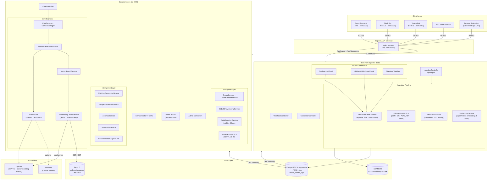

# Architecture

Docs-inator is a two-service Spring Boot application backed by PostgreSQL with pgvector. A React frontend and a set of optional integration clients (Slack, Teams, browser extension, VS Code extension) talk to the two services over HTTPS.

---

## System Diagram



---

## Service Responsibilities

### documentation-bot (port 8082)

The user-facing API. All user interactions — chat, authentication, admin operations — flow through here.

**Core responsibilities:**

- Multi-turn chat sessions with sliding-window context (last 10 messages + LLM-generated rolling summary at 15 messages)
- Hybrid vector retrieval and answer generation
- JWT, API key, and OIDC/SSO authentication
- Rate limiting (Bucket4j, 30 req/min per user by default)
- Multi-tenancy: resolves tenant from JWT, scopes every query via `TenantContext`
- ACL enforcement: `GrantBasedDocumentAccessPolicy` computes which document IDs each user can search before retrieval
- LLM routing with circuit breaker, bulkhead, and automatic fallback
- Intelligence features: multi-hop reasoning, version diff, auto-FAQ, People Also Asked, answer evolution
- Admin: analytics, gap reports, cost tracking, escalation workflow, audit log
- GDPR: data export (Art. 20) and erasure (Art. 17) with 7-day grace period, nightly processor

### document-ingestor (port 8081)

The ingestion pipeline. Accepts documents via upload, webhook, or connector, and builds the vector index.

**Core responsibilities:**

- Document upload and binary storage in S3/MinIO
- Parsing via Apache Tika → HTML → Markdown (`StructuredTextExtractor`)
- PII detection before storage (SSN, credit cards, AWS keys, email, phone, IP) — quarantines flagged documents
- Semantic chunking with Markdown heading/table/code-block awareness (800-token target, 100-token overlap)
- OpenAI embedding generation (text-embedding-3-small, 1536 dimensions)
- Atomic chunk storage: all chunks committed in one transaction, status flipped to `COMPLETED`
- SSRF-protected URL fetching (`SafeUrlValidator`): HTTPS-only, private IP block, 3-hop redirect cap
- HMAC-SHA-256 verification for CI/CD webhook ingestion
- Internal API for bot→ingestor calls (presigned S3 download URLs for citations)
- Stuck-document reaper: marks documents stuck in `PROCESSING` > 30 minutes as `FAILED`
- PostgreSQL `LISTEN/NOTIFY` on `docai_ingestion_completed` to signal the bot service

---

## RAG Query Flow

```text
User question (POST /api/chat/sessions/{id}/messages)
    │
    ▼
TenantResolutionFilter   resolves tenant_id from JWT claim
    │
    ▼
RateLimitFilter          30 req/min per user (Bucket4j + Redis)
    │
    ▼
JwtAuthFilter / ApiKeyAuthFilter
    │
    ▼
ChatService.sendMessage()
    │
    ├── ContextManager
    │     Loads last 10 messages; if session has a rolling summary,
    │     prepends it as system context.
    │
    ├── QueryAnalyzerService
    │     Classifies query type: simple / complex / multi-hop / version-diff.
    │
    ├── DocumentAccessPolicy.resolveScope(user)
    │     Computes SearchScope(tenantId, documentIds) from:
    │       - Direct per-user document_access grants
    │       - Group memberships → group_document_access grants
    │
    ├── VectorSearchService
    │     ┌── Dense retrieval: cosine similarity on document_chunks.embedding (pgvector HNSW)
    │     ├── Lexical retrieval: ts_rank on tsvector generated column
    │     ├── RRF fusion (Reciprocal Rank Fusion in Java)
    │     └── MMR re-ranking (MaximalMarginalRelevance) + optional LLM scoring pass
    │           EmbeddingCacheService: Redis SHA-256 cache (model name included in key)
    │
    ├── AnswerGenerationService  or  MultiHopReasoningService
    │     LLMRouter selects provider (per-tenant config + circuit breaker + fallback)
    │     Minimum similarity threshold: 0.55 (refuses to answer below this)
    │
    ├── QueryLog saved (async)
    ├── PeopleAlsoAskedService (async)
    │
    └── ChatResponse
          content, citations (document + chunk + excerpt + relevance score),
          confidence (HIGH / MEDIUM / LOW), followUpQuestions
```

---

## Multi-Tenancy Model

Every data table carries a `tenant_id` column. All queries are automatically scoped — no data from one tenant is ever visible to another.

**Tenant resolution order (per request):**

1. Authenticated principal's `tenantId` (from JWT or API key) — authoritative, cannot be overridden by a header.
2. `X-Tenant-Id` header (UUID) — consulted only for unauthenticated requests (e.g. public branding lookup).
3. `X-Tenant-Slug` header (slug lookup) — same, unauthenticated only.

If none resolve and the endpoint requires a tenant, the request is rejected. There is no default tenant fallback.

`TenantContext` (ThreadLocal) is always cleared in a `finally` block. Async propagation (SSE streams, `@Async` ingestion) uses `ContextPropagatingTaskDecorator` to carry `TenantContext`, MDC log fields, and Spring Security context across thread pool hand-offs.

---

## LLM Routing

```text
Tenant has LLM config?
  ├─ YES, smartRouting = true
  │     simple query   → simpleQueryModel  (e.g. gpt-4o-mini)
  │     complex query  → complexQueryModel (e.g. gpt-4o)
  ├─ YES, smartRouting = false
  │     always use     → chatModel
  └─ NO  → OpenAI gpt-4o-mini (platform default)

Any provider exception → automatic fallback to OpenAI gpt-4o-mini

Wrapped in: Resilience4j circuit breaker + bulkhead (max 5 concurrent LLM calls)
```

Per-tenant LLM API keys are encrypted at rest with AES-256-GCM (`SecretsCryptoService`, random 12-byte IV prefixed to ciphertext). The same `SECRETS_ENCRYPTION_KEY` must be set on both services.

---

## Key Design Decisions

| Decision | Rationale |
|---|---|
| Shared PostgreSQL + pgvector (no separate vector DB) | Transactional consistency between relational data and vector data without an extra infrastructure component |
| Row-level tenant isolation (not schema-per-tenant) | Simpler migrations; acceptable for the expected scale; adding schema-per-tenant later is possible via Flyway |
| S3/MinIO only (no local filesystem) | Forces content-addressable storage, enables horizontal scaling, and simplifies backup |
| Invitation-only signup | Prevents unauthorized tenant creation; every account traces back to a SUPER_ADMIN decision |
| `GrantBasedDocumentAccessPolicy` as the single ACL seam | Adding a new access model (e.g. attribute-based) requires only a new implementation — no retrieval code changes |
| Embedding cache keyed on SHA-256(model + query text) | Cache automatically invalidated when the embedding model changes; no explicit cache invalidation needed |
| `ContextPropagatingTaskDecorator` everywhere | Ensures `tenant_id`, `user_id`, and `trace_id` survive thread pool hand-offs in logs |
| Hybrid dense + lexical retrieval with RRF | Dense retrieval handles semantic paraphrases; lexical retrieval handles exact model names, error codes, and version strings — RRF fusion outperforms either alone |

---

**Next:** [Configuration](configuration.md) — environment variables for both services.
